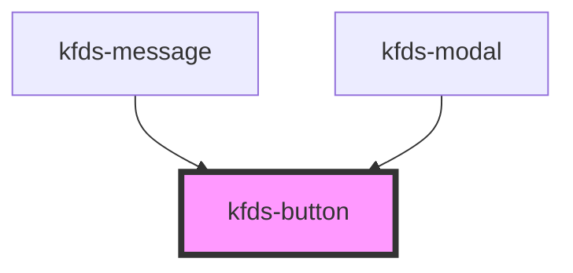

# kds-button

<!-- Auto Generated Below -->

## Properties

| Property      | Attribute      | Description | Type                                                                                                                        | Default               |
| ------------- | -------------- | ----------- | --------------------------------------------------------------------------------------------------------------------------- | --------------------- |
| `buttonStyle` | `button-style` |             | `ButtonStyle.Borderless \| ButtonStyle.Destructive \| ButtonStyle.Primary \| ButtonStyle.Secondary \| ButtonStyle.Tertiary` | `ButtonStyle.Primary` |
| `customClass` | `custom-class` |             | `string`                                                                                                                    | `''`                  |
| `disabled`    | `disabled`     |             | `boolean`                                                                                                                   | `undefined`           |
| `elementId`   | `element-id`   |             | `string`                                                                                                                    | `undefined`           |
| `size`        | `size`         |             | `ButtonSize.Big \| ButtonSize.Extra \| ButtonSize.Medium \| ButtonSize.Small`                                               | `ButtonSize.Small`    |
| `type`        | `type`         |             | `ButtonType.Button \| ButtonType.Reset \| ButtonType.Submit`                                                                | `ButtonType.Button`   |

## Events

| Event           | Description | Type               |
| --------------- | ----------- | ------------------ |
| `buttonClicked` |             | `CustomEvent<any>` |

## Shadow Parts

| Part       | Description |
| ---------- | ----------- |
| `"button"` |             |

## Dependencies

### Used by

 - [kfds-message](../../molecules/kfds-message)
 - [kfds-modal](../../molecules/kfds-modal)

### Graph

----------------------------------------------

*Built with [StencilJS](https://stenciljs.com/)*
