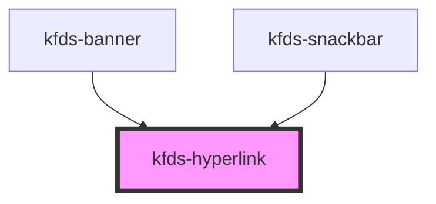

# kfds-hyperlink

<!-- Auto Generated Below -->

## Properties

| Property      | Attribute      | Description | Type     | Default     |
| ------------- | -------------- | ----------- | -------- | ----------- |
| `customClass` | `custom-class` |             | `string` | `undefined` |
| `elementId`   | `element-id`   |             | `string` | `undefined` |
| `href`        | `href`         |             | `string` | `undefined` |
| `target`      | `target`       |             | `any`    | `undefined` |

## Events

| Event         | Description | Type               |
| ------------- | ----------- | ------------------ |
| `linkClicked` |             | `CustomEvent<any>` |

## Shadow Parts

| Part          | Description |
| ------------- | ----------- |
| `"hyperlink"` |             |

## Dependencies

### Used by

 - [kfds-banner](../../molecules/kfds-banner)
 - [kfds-snackbar](../../molecules/kfds-snackbar)

### Graph

----------------------------------------------

*Built with [StencilJS](https://stenciljs.com/)*
