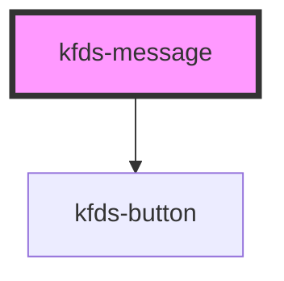

# kfds-message

<!-- Auto Generated Below -->

## Properties

| Property       | Attribute       | Description | Type     | Default               |
| -------------- | --------------- | ----------- | -------- | --------------------- |
| `actions`      | `actions`       |             | `any`    | `undefined`           |
| `customClass`  | `custom-class`  |             | `string` | `''`                  |
| `elementId`    | `element-id`    |             | `string` | `undefined`           |
| `messageTitle` | `message-title` |             | `string` | `undefined`           |
| `position`     | `position`      |             | `string` | `MessagePosition.Top` |
| `type`         | `type`          |             | `string` | `MessageType.Info`    |

## Events

| Event                 | Description | Type                  |
| --------------------- | ----------- | --------------------- |
| `actionButtonClicked` |             | `CustomEvent<string>` |

## Shadow Parts

| Part                         | Description |
| ---------------------------- | ----------- |
| `"message-body"`             |             |
| `"message-button"`           |             |
| `"message-button-container"` |             |
| `"message-close"`            |             |
| `"message-container"`        |             |
| `"message-icon"`             |             |
| `"message-title"`            |             |
| `"message-title-container"`  |             |

## Dependencies

### Depends on

- [kfds-button](../../atoms/kfds-button)

### Graph

----------------------------------------------

*Built with [StencilJS](https://stenciljs.com/)*
