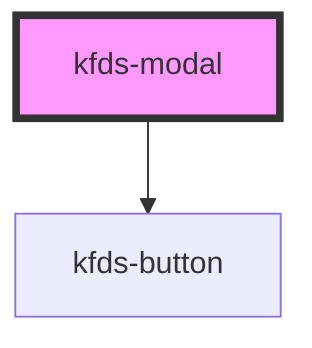

# kfds-modal

<!-- Auto Generated Below -->

## Properties

| Property           | Attribute           | Description | Type      | Default     |
| ------------------ | ------------------- | ----------- | --------- | ----------- |
| `actions`          | `actions`           |             | `any`     | `undefined` |
| `elementId`        | `element-id`        |             | `string`  | `undefined` |
| `modalTitle`       | `modal-title`       |             | `string`  | `undefined` |
| `showIllustration` | `show-illustration` |             | `boolean` | `false`     |
| `visible`          | `visible`           |             | `boolean` | `false`     |

## Events

| Event                 | Description | Type                  |
| --------------------- | ----------- | --------------------- |
| `actionButtonClicked` |             | `CustomEvent<string>` |

## Shadow Parts

| Part                             | Description |
| -------------------------------- | ----------- |
| `"modal-action-button"`          |             |
| `"modal-action-container"`       |             |
| `"modal-body"`                   |             |
| `"modal-container"`              |             |
| `"modal-illustration-container"` |             |
| `"modal-main-container"`         |             |
| `"modal-title"`                  |             |
| `"modal-title-body-container"`   |             |
| `"modal-title-container"`        |             |
| `"modal-wrapper"`                |             |

## Dependencies

### Depends on

- [kfds-button](../../atoms/kfds-button)

### Graph

----------------------------------------------

*Built with [StencilJS](https://stenciljs.com/)*
