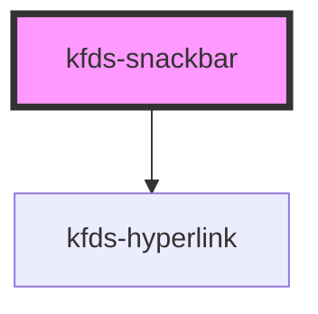

# kfds-snackbar

<!-- Auto Generated Below -->

## Properties

| Property             | Attribute             | Description | Type      | Default                           |
| -------------------- | --------------------- | ----------- | --------- | --------------------------------- |
| `actions`            | `actions`             |             | `any`     | `undefined`                       |
| `autoHide`           | `auto-hide`           |             | `boolean` | `true`                            |
| `customClass`        | `custom-class`        |             | `string`  | `''`                              |
| `duration`           | `duration`            |             | `number`  | `10000`                           |
| `elementId`          | `element-id`          |             | `string`  | `undefined`                       |
| `horizontalPosition` | `horizontal-position` |             | `string`  | `SnackbarHorizontalPosition.Left` |
| `message`            | `message`             |             | `string`  | `undefined`                       |
| `showClose`          | `show-close`          |             | `boolean` | `true`                            |
| `type`               | `type`                |             | `string`  | `SnackbarType.Info`               |
| `verticalPosition`   | `vertical-position`   |             | `string`  | `SnackbarVerticalPosition.Bottom` |
| `visible`            | `visible`             |             | `boolean` | `false`                           |

## Events

| Event               | Description | Type                  |
| ------------------- | ----------- | --------------------- |
| `actionLinkClicked` |             | `CustomEvent<string>` |

## Shadow Parts

| Part                   | Description |
| ---------------------- | ----------- |
| `"action-link"`        |             |
| `"close"`              |             |
| `"icon"`               |             |
| `"message"`            |             |
| `"snackbar-container"` |             |

## Dependencies

### Depends on

- [kfds-hyperlink](../../atoms/kfds-hyperlink)

### Graph

----------------------------------------------

*Built with [StencilJS](https://stenciljs.com/)*
